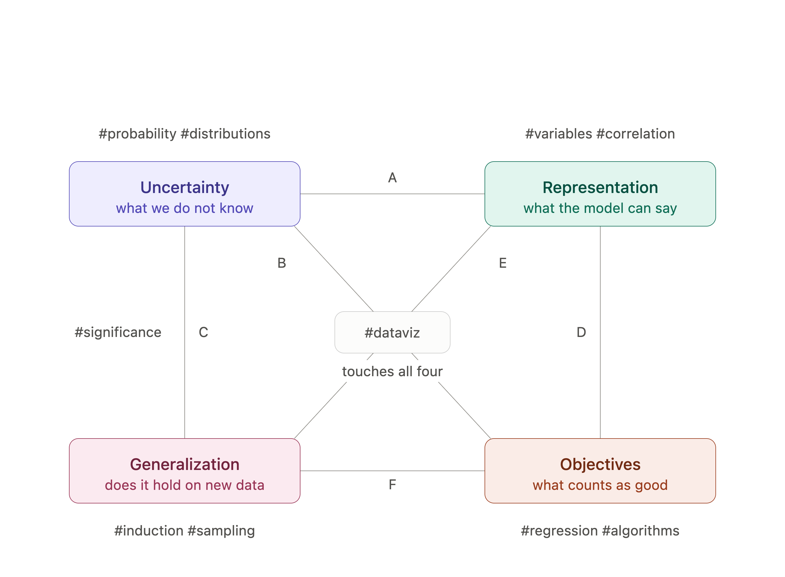
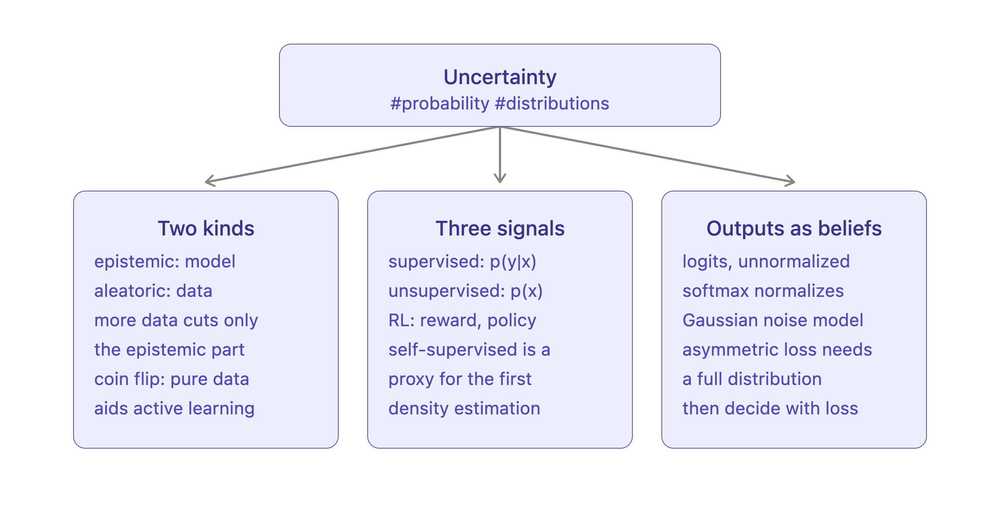
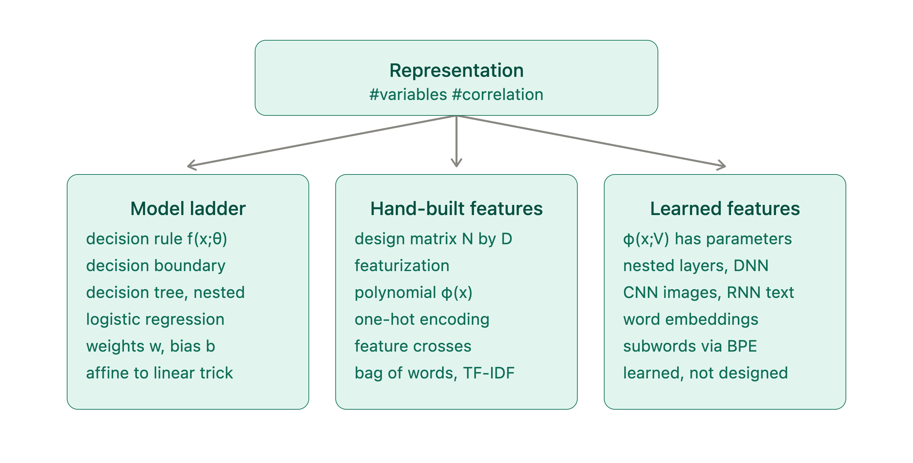
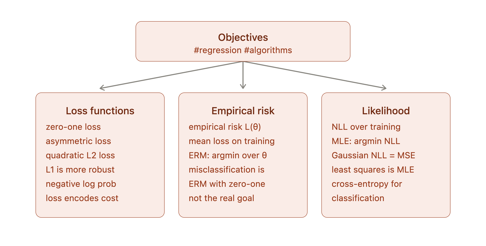
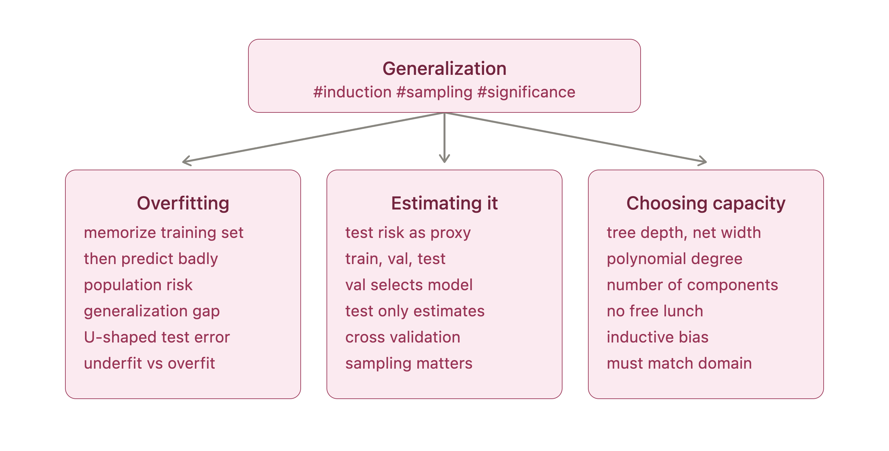

# 2.3 — Mind map

**Status: Done.**

A mind map for machine learning, built from chapter 1 of Murphy plus the LLM outline from
[2.2](2.2.md). Reading notes for the chapter are in
[`Notes/murphy_ch1_condensed.md`](Notes/murphy_ch1_condensed.md).

The map organises the chapter around **four concepts** rather than around the chapter's own
section order, and every link between them is drawn explicitly.

## The map

The four concepts, each phrased as the question it answers:

| Concept | The question it answers | HCs |
|---|---|---|
| **Uncertainty** | what we do not know | `#probability` `#distributions` |
| **Representation** | what the model can say | `#variables` `#correlation` |
| **Generalization** | does it hold on new data | `#induction` `#sampling` `#significance` |
| **Objectives** | what counts as good | `#regression` `#algorithms` |

`#dataviz` sits at the centre because it touches all four rather than belonging to any one
of them. All ten assigned HCs appear on the map.

Four concepts give six pairs, and the map draws all six as labelled edges:

| Edge | Connects | What the connection is |
|---|---|---|
| **A** | Uncertainty ↔ Representation | Probability turns a function class into a distribution family. A deterministic $f(x;\theta)$ becomes $p(y \mid x;\theta)$ by wrapping it in a noise model, and a prior over parameters is inductive bias in its most explicit form. |
| **B** | Uncertainty ↔ Objectives | The probability model *generates* the loss; they are not chosen independently. Set $\ell = -\log p(y \mid f(x;\theta))$ and empirical risk minimisation becomes maximum likelihood. |
| **C** | Uncertainty ↔ Generalization | Generalization is defined as an expectation, so it is probabilistic by construction. Test risk is a Monte Carlo estimate of a population risk you never observe. |
| **D** | Representation ↔ Objectives | The representation fixes the geometry of the loss surface, which decides whether optimisation is easy. Linear in the parameters gives a convex MSE; a learned $\phi$ destroys convexity, which is why backprop exists. |
| **E** | Representation ↔ Generalization | Capacity is the main control on the generalization gap — polynomial degree, tree depth, network width are the same knob under different names. |
| **F** | Generalization ↔ Objectives | You minimise the objective you can compute and want the one you cannot. That gap is the whole discipline; regularization and the three-way split are responses to it. |

The two edges worth working hardest are **D** and **F** — B and C tend to click on first contact.

## Each node expanded

Every concept breaks into three sub-branches, which is where the chapter's specific
machinery gets attached.

### Uncertainty

The epistemic/aleatoric split, the three learning signals as three different probability
objects — supervised `p(y|x)`, unsupervised `p(x)`, RL reward and policy — and the move
from hard labels to distributions via logits and softmax.

### Representation

The ladder from a decision rule `f(x;θ)` up through logistic regression, then the split
between features you design by hand (polynomial `φ(x)`, one-hot, feature crosses, TF-IDF)
and features the model learns for itself (`φ(x;V)`, nested layers, embeddings, BPE).

### Objectives

Loss functions as the place preferences get encoded, empirical risk minimisation as the
definition of training, and the likelihood view that makes the two connect — least squares
turning out to be maximum likelihood under Gaussian noise.

### Generalization

Why minimising training loss is not the real goal, the three-way train/validation/test
split that estimates the real thing, and no free lunch as the reason capacity has to be
chosen per domain rather than once and for all.

## Where the map came from, and where it disagrees with Murphy

The four-node carving is **not** Murphy's. Chapter 1 organises the field by type of training
signal — supervised, unsupervised, reinforcement — which answers *what data do you have*. This
map instead answers *what decisions must you make to build a model*. The two taxonomies
cross-cut, which is exactly the comparison question 2.2 asks for. In this map the
supervised/unsupervised/RL split sits **inside** the Uncertainty node, because chapter 1
itself defines the difference probabilistically: conditional $p(y \mid x)$ versus
unconditional $p(x)$.

Four HC placements are arguable and worth defending:

- **`#correlation` under Representation, not Uncertainty.** Its definition is probabilistic,
  but its job in an ML course is to say which features carry redundant information and whether
  a linear model can express the relationship at all — questions about what the model can say.
- **`#regression` under Objectives.** Not because regression is a loss, but because it is the
  cleanest worked example of the whole node: model, plus loss, plus optimiser, with the loss
  falling out of a Gaussian likelihood.
- **`#sampling` and `#significance` both sit on edge C.** Train/test splits and bootstrap
  resamples manufacture pseudo-independent data to estimate population risk; asking whether a
  two-point accuracy gap is real needs a sampling distribution under a null.
- **`#dataviz` at the centre.** Pair plots inspect distributions, residual plots diagnose the
  objective, learning curves are generalization, t-SNE interrogates a representation. It is a
  practice layer across all four, not a concept within one.

Two caveats carried over from the conversation:

- **The U-shaped test error curve is the classical picture, and it is contested.** Heavily
  overparameterised networks interpolate the training set and then keep improving — double
  descent. Murphy presents the classical curve without that qualification.
- **Two things are missing and should be added as the semester goes on:** *decision theory*,
  which turns a posterior into an action, and *scale*, since data and compute now behave as
  first-class design variables. Neither has a hashtag in the course list, which is itself
  informative.

Full reasoning is in the [2.2 transcript](2.2.md), turns 4 through 7.
