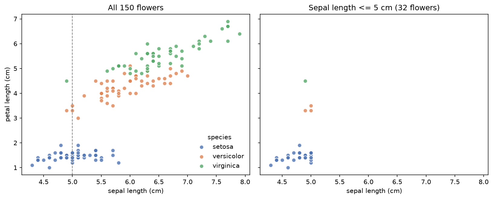
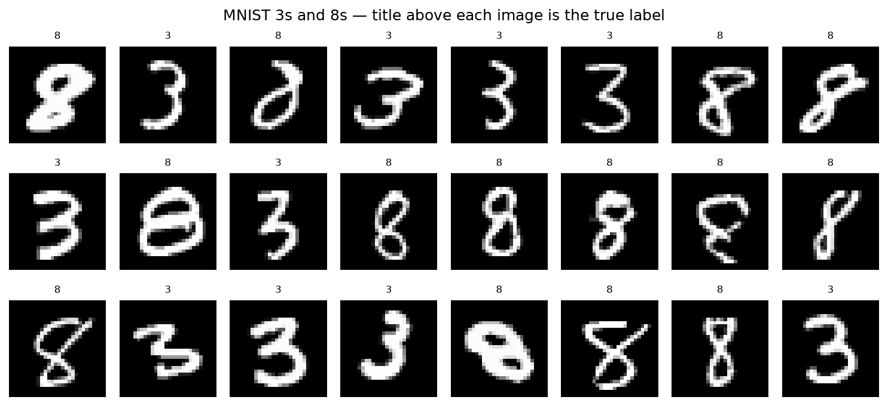

# Session 1 — Introduction and overview of machine learning concepts

[](https://mybinder.org/v2/gh/Brady-Rutherford/cs156-ml/main?urlpath=lab/tree/PCW/Session%201%20-%20Introduction%20and%20overview%20of%20machine%20learning%20concepts)

Pre-class work for the first session. Covers what machine learning is, a mind map of its
core concepts, and a first hands-on data pipeline.

| # | Question | Deliverable | Status |
|---|---|---|---|
| 2.1 | Pre-class work | [`2.1.md`](2.1.md) | Done |
| 2.2 | Interviewing Robots | [`2.2.md`](2.2.md) | Done |
| 2.3 | Mind map | [`2.3.md`](2.3.md) | Done |
| 3.1 | Code Practice | [`3.1-iris.ipynb`](3.1-iris.ipynb), [`3.1-mnist.ipynb`](3.1-mnist.ipynb), [`3.1-conversation-log.md`](3.1-conversation-log.md) | Done |

## Reading notes

[`Notes/murphy_ch1_condensed.md`](Notes/murphy_ch1_condensed.md) — a condensed pass over
chapter 1 of Murphy's *Probabilistic Machine Learning*, the reading behind question 2.2.
It follows the chapter's own arc: what ML is and why probabilistic, the model / loss /
optimizer template, regression as the same skeleton with a different loss, overfitting and
no free lunch, then unsupervised learning, RL, and preprocessing.

The section worth reading first is the last one, which ranks the chapter by where the time
is best spent — printed pages 5 to 9 carry the definitions every later chapter is a
variation on.

Two things in the notes connect straight to the code in this folder:

- Murphy uses **Iris** as his running example, and the $150 \times 4$ design matrix he
  describes is literally what `3.1-iris.ipynb` builds.
- He notes **MNIST** is now considered too easy, since many digit pairs separate on a
  single pixel — which is why `3.1-mnist.ipynb` uses 3 vs 8 rather than an easy pair.

## 3.1 Code Practice — what the two notebooks show

**Script 1 — Iris** (`3.1-iris.ipynb`). Loads the 150 iris flowers into a pandas
DataFrame, drops every row with sepal length greater than 5 cm, and scatter-plots petal
length against sepal length with each dot colored by species. Every step is commented in
plain terms: what an iris is, what a sepal is, that the units are centimeters, and what
the filter does.

The finding worth reading for: **the filter keeps 32 of 150 flowers, and 28 of them are
setosa.** A rule phrased as a size cutoff turns out to be very nearly a species filter,
because setosa is simply the smaller flower. The plot keeps both the before and the after
side by side so the bite the filter takes is visible rather than asserted.



Setosa (blue) sits alone in the bottom left, separated from the other two by a clear gap —
short sepals and very short petals. Versicolor and virginica overlap along a shared upward
trend. The dashed line is the 5 cm cutoff; everything right of it is deleted, which is
nearly everything that is not setosa.

**Script 2 — MNIST** (`3.1-mnist.ipynb`). Loads 70,000 handwritten digits into a
70000 × 785 DataFrame, keeps only the 3s and the 8s (13,966 images, 20% of the data), and
displays grids of them. The comments explain how the images are stored — each 28×28
picture arrives as a flat row of 784 brightness values, 0 black to 255 white — and what
folding a row back into a square with `.reshape(28, 28)` and `imshow` is doing.



After the mixed grid there is one row of 3s and one row of 8s, so the variation on screen
is handwriting style rather than which digit it is.


That variation is the point: a hand-written rule like "an 8 has two closed loops" breaks
the moment someone leaves a loop slightly open.

## Running these notebooks

**In your browser, nothing to install** — Binder builds this repo into a live JupyterLab:

- [Run Script 1, Iris](https://mybinder.org/v2/gh/Brady-Rutherford/cs156-ml/main?urlpath=lab/tree/PCW/Session%201%20-%20Introduction%20and%20overview%20of%20machine%20learning%20concepts/3.1-iris.ipynb)
- [Run Script 2, MNIST](https://mybinder.org/v2/gh/Brady-Rutherford/cs156-ml/main?urlpath=lab/tree/PCW/Session%201%20-%20Introduction%20and%20overview%20of%20machine%20learning%20concepts/3.1-mnist.ipynb)

The first launch takes a few minutes while the environment builds. Or just click a
notebook in this folder to read it on GitHub with all its output already rendered.

**Locally**, from the repository root:

```bash
uv sync
uv run python -m ipykernel install --user --name cs156-ml --display-name "Python (cs156-ml)"
```

Then open either notebook in VS Code or Cursor and run the cells — the `Python (cs156-ml)`
kernel is selected automatically. Or use `uv run jupyter lab` for the classic UI.

Iris needs no download. MNIST pulls ~15MB from OpenML on first run and caches it outside
the repo.

## Files

```
Notes/                    reading notes for this session
  murphy_ch1_condensed.md   condensed Murphy chapter 1
2.1.md                    question 2.1
2.2.md                    the Interviewing Robots prompt and transcript
2.3.md                    the mind map and the HCs it covers
3.1-iris.ipynb            Script 1
3.1-mnist.ipynb           Script 2
3.1-conversation-log.md   the LLM conversation behind the scripts
assets/                   figures the notebooks save, plus handwritten work
```
