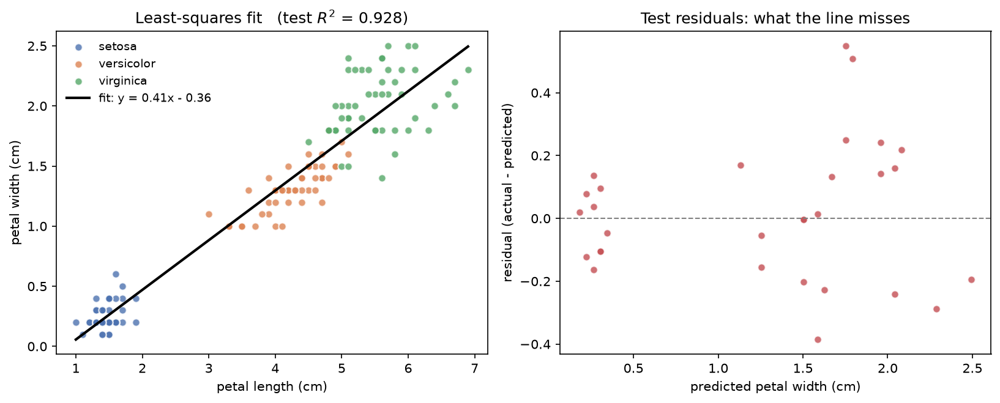
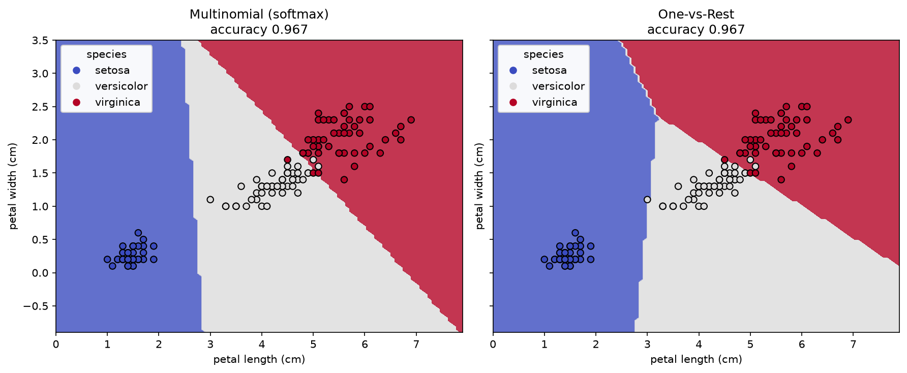
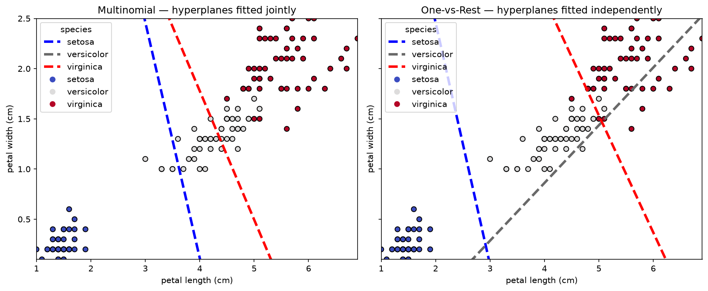
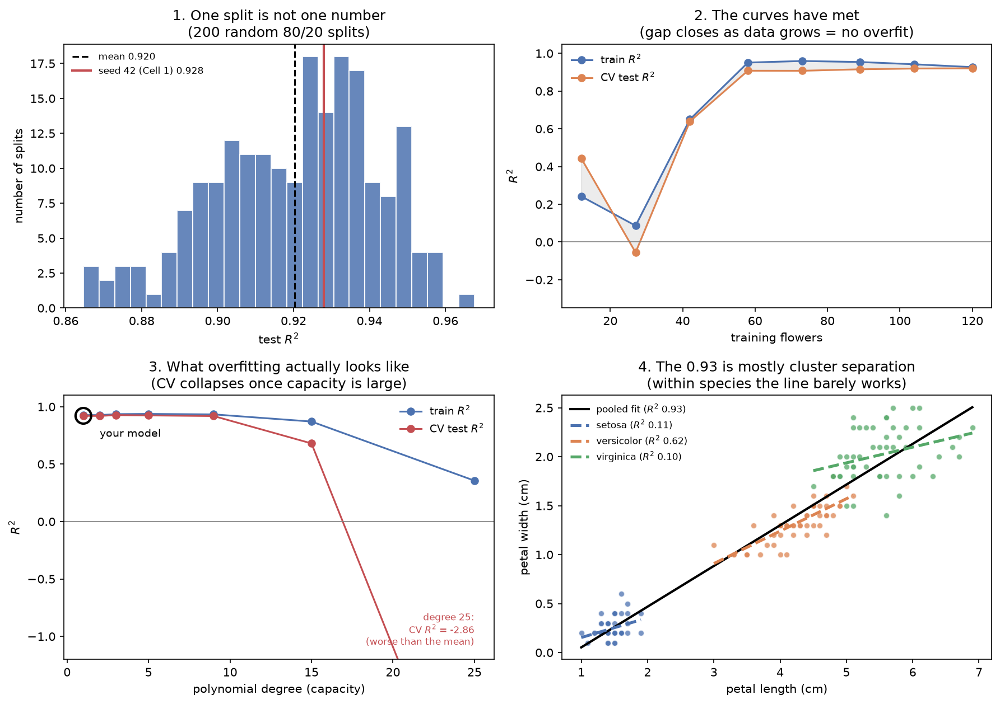
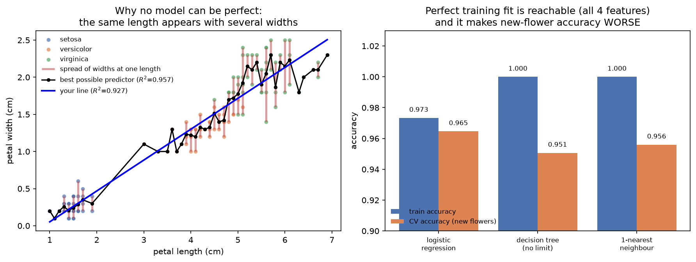
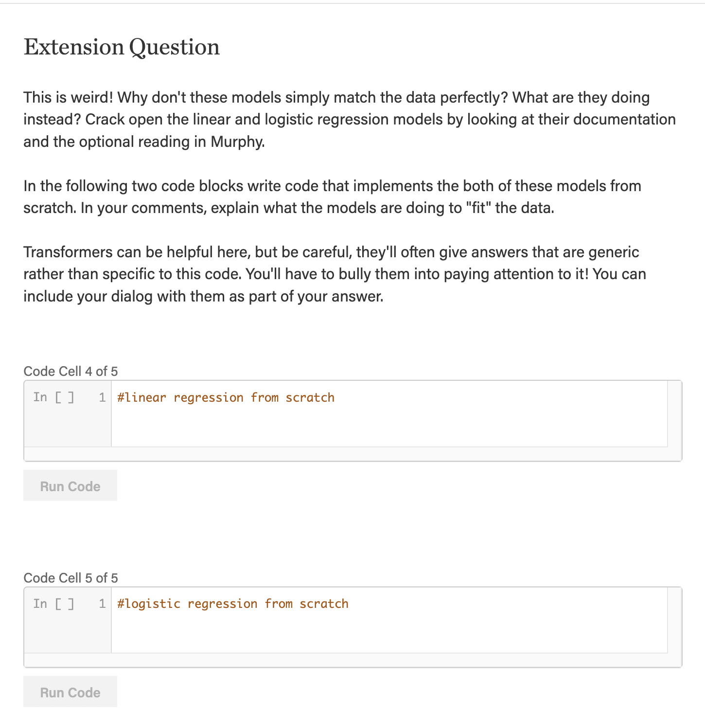
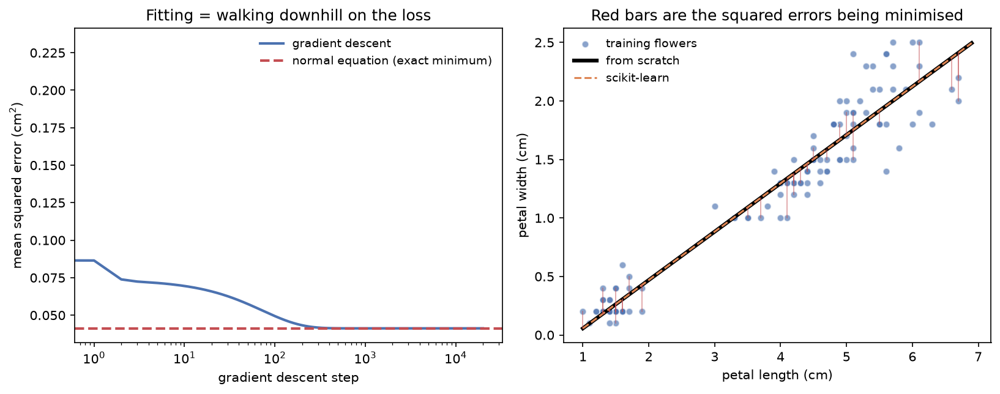
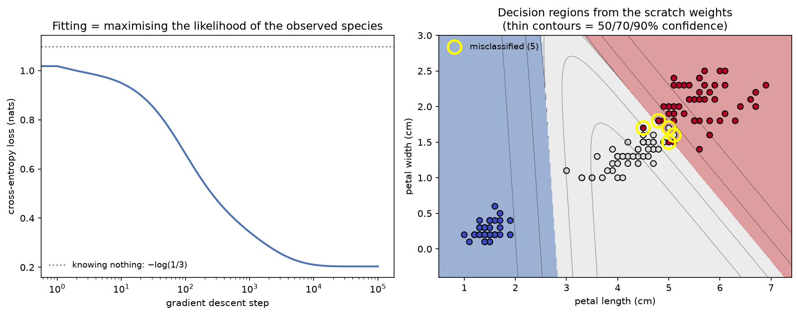

# Session 2 — Linear Algebra 1: Tensors, Classification, and Regression

[](https://mybinder.org/v2/gh/Brady-Rutherford/cs156-ml/main?urlpath=lab/tree/PCW/Session%202%20-%20Linear%20Algebra%201%20-%20Tensors%2C%20Classification%2C%20and%20Regression)

Pre-class work for the second session. Implements the two models the session is built on —
linear regression and logistic regression — on the same 150 iris flowers, first with
scikit-learn and then from scratch in numpy.

| # | Question | Deliverable | Status |
|---|---|---|---|
| Drawing Lines | Replicate the two reading guides: pull Iris, fit a linear regression and a logistic regression, visualize the output | [`drawing-lines.ipynb`](drawing-lines.ipynb) — Code Cells 1 and 2 | Done |
| Extension Question | Why don't the models match the data perfectly? Implement both from scratch, commenting on what they do to "fit" | [`drawing-lines.ipynb`](drawing-lines.ipynb) — Code Cells 4 and 5 | Done |

Everything lives in one notebook, [`drawing-lines.ipynb`](drawing-lines.ipynb). The four booklet
cells are labelled `CODE CELL 1`, `2`, `4`, `5` in banner comments, and **each is self-contained**
— its own imports, its own `load_iris()` call, nothing imported from this repo — so any one can be
pasted into the booklet's cell runner and executed alone.

| booklet cell | what it does |
|---|---|
| **1** | linear regression via scikit-learn: petal width from petal length |
| **2** | logistic regression via scikit-learn: 3 species, multinomial vs one-vs-rest |
| **4** | linear regression **from scratch** — normal equation *and* gradient descent |
| **5** | logistic regression **from scratch** — softmax + cross-entropy + gradient descent |

Between cells 2 and 4 the notebook carries an analysis section that is not a booklet cell: it
answers whether the Cell 1 fit overfits, and whether any model could fit this data perfectly.

## Code Cell 1 — linear regression with scikit-learn

The fitted line is

$$\text{petal width} = 0.41 \times \text{petal length} - 0.36$$

with **test $R^2 = 0.928$** (train 0.927) and test MSE 0.046 cm².



The line runs through **three separate clouds** — setosa alone in the bottom left, versicolor and
virginica stacked along the top right — even though species is never an input. That turns out to
matter a lot, and the analysis section below is where it gets taken apart. The intercept of
$-0.36$ is also a visible flaw: a petal of length 0 would be predicted to have *negative* width,
so the fit is a good local description over the 1–6.9 cm range the data covers and nonsense
outside it.

## Code Cell 2 — logistic regression with scikit-learn

Both multinomial and one-vs-rest score **96.7% — 145 of 150 flowers**. Setosa is perfect (50/50)
and **every single error is versicolor confused with virginica.**



The two boundaries are not equally trustworthy. The setosa boundary sits in a wide **empty gap**
— no flower is near it, so its position is arbitrary and the model is very confident. The
versicolor/virginica boundary is driven through a region where points of both colours sit on the
wrong side of it.



The hyperplane panels are *not* the boundaries above — each dashed line is where one class's own
score crosses zero. Setosa and virginica land in nearly the same place either way, but **the
versicolor line is completely different**: under one-vs-rest it cuts diagonally through the data,
under multinomial it leaves the plotted range entirely. One-vs-rest has to answer "versicolor vs
everything else" with a single line, and versicolor is sandwiched *between* the other two — a
question one line cannot answer. Multinomial fits all three at once, so versicolor simply wins
where the other two lose.

## Analysis — does the fit overfit, and could anything fit it perfectly?

**No, it cannot overfit.** Cell 1 fits **2 parameters to 150 points — 75 observations per
parameter.** A straight line has no freedom to bend around noise. Four measurements confirm it:



1. Across **200 random splits**, test $R^2$ ranged 0.865–0.968. The 0.928 Cell 1 prints is one
   draw from that spread, not a property of the model.
2. The train–test gap is **$+0.007 \pm 0.026$** — smaller than its own noise — and **in 44% of
   splits the test score beat the train score.** A coin-flip gap sign means there is no
   overfitting to find. The learning curve agrees: the curves *meet* at ~0.92.
3. The control: push capacity up and overfitting appears on cue. Degree 15 opens a $+0.19$ gap;
   degree 25 reaches **CV $R^2 = -2.86$**, worse than predicting the mean.
4. **The finding that actually matters, and it is not overfitting.** Fit the same line *within*
   each species and it mostly stops working — setosa CV $R^2 = -0.21$, virginica $-0.21$, both
   worse than predicting that species' mean width. Only versicolor holds up ($+0.45$).

That last point is a correction to the obvious reading of the slope. The pooled 0.93 is largely
the model noticing that setosa is small and virginica is large — *between-species* variation, not
a law about petal shape. Same family as Simpson's paradox. So the honest phrasing is
**"bigger-petalled species tend to have proportionally wider petals,"** not "an individual petal
widens at 0.41 cm per cm of length."

### Could a different model fit it perfectly?



**Regression — impossible, by arithmetic.** 29 of the 43 distinct petal lengths appear with more
than one petal width; petal length 1.5 cm shows up with widths 0.1, 0.2, 0.3 *and* 0.4. No
function returns four values for one input, so the ceiling on $R^2$ for **any** model using petal
length alone is **0.9571**, not 1.0. The straight line already gets 0.9271, leaving only 0.03 of
recoverable $R^2$ — and a decision tree with unlimited depth confirms the ceiling by reaching
exactly 0.9571 and no further. The rest is irreducible (Bayes) error: a property of the data, not
a failing of the model.

**Classification — reachable, and it backfires.** With all four features there are no
contradictory rows, so a tree and 1-NN both hit 100% training accuracy:

| model (all 4 features) | train acc | CV acc |
|---|---|---|
| logistic regression | 0.973 | **0.965** |
| decision tree, unlimited depth | **1.000** | 0.951 |
| 1-nearest-neighbour | **1.000** | 0.956 |

**The two models that fit perfectly are the two that generalise worst.** Overfitting, demonstrated
on this dataset rather than described.

## Extension Question — the models from scratch



**Why don't they match the data perfectly?** Neither is trying to. Each is handed a small family
of allowed shapes and a scoring rule, and returns the best member of that family:

| | family it must choose from | score it minimises | how the minimum is found |
|---|---|---|---|
| linear regression | straight lines $w_1x + w_0$ — **2 parameters** | mean squared error | **closed form** — one linear solve |
| logistic regression | straight-boundary slicings of the plane | cross-entropy + L2 | **iteratively** — no closed form exists |

### Code Cell 4 — linear regression from scratch



Implemented twice — the **normal equation** $(X^\top X)w = X^\top y$, solved exactly in one step,
and **gradient descent**, 20,000 steps downhill. Both land on scikit-learn's answer to
**16 decimal places** ($4 \times 10^{-16}$):

$$\text{intercept} = -0.356668, \qquad \text{slope} = 0.413238$$

The cell's last two prints are the real explanation of why the line misses the points. At the
minimum the residuals **sum to zero** and are **orthogonal to petal length** ($\approx 10^{-13}$).
Orthogonality is the whole story: the line has already extracted every bit of *straight-line*
signal that petal length carries, and what remains is by construction uncorrelated with $x$, so no
slope or intercept could reduce it. The model has not failed to fit — it has hit the edge of what
2 parameters can express.

### Code Cell 5 — logistic regression from scratch



Softmax, cross-entropy loss, and the gradient $X^\top(P - Y)/n$ — where $(P - Y)$ is literally
"predicted probability minus what happened". Starting from "every species equally likely", the
loss falls from $-\log(1/3) = 1.0986$ to $0.2034$ over 100,000 steps, with the loss **never once
increasing**. The scratch weights match scikit-learn's to three decimals, with **identical
predictions on all 150 flowers** and probabilities agreeing to $3 \times 10^{-4}$.

Step size is its own lesson here. Petal length spans 1–7 cm while petal width spans 0.1–2.5, so
the loss surface is a long narrow valley: at `lr=0.5` the loss oscillates for ~1000 steps before
settling, and at `lr=1.0` it diverges outright. `lr=0.1` descends monotonically.

**Why this cell must iterate and Cell 4 need not.** Setting $\nabla J = 0$ in Cell 4 gives a
linear system. Here it gives $X^\top(\mathrm{softmax}(XW + b) - Y) = 0$, with $W$ buried inside an
exponential inside a normalising sum — no algebraic solution exists, so descending the loss is the
only available method. That is the point of the extension question: **once a model stops being
linear in its parameters, closed forms disappear and iterative optimisation becomes the universal
tool.** Everything from here to deep networks is this loop.

## Readings behind this

| Reading | How it is used |
|---|---|
| [Basic Linear Regression using the Iris Data set](https://medium.com/analytics-vidhya/linear-regression-using-iris-dataset-hello-world-of-machine-learning-b0feecac9cc1) | Code Cell 1: the load → split → fit → score → plot pipeline on Iris |
| [Basic Logistic Regression using the Iris Data set](https://scikit-learn.org/stable/auto_examples/linear_model/plot_logistic_multinomial.html) | Code Cell 2: multinomial vs one-vs-rest, `DecisionBoundaryDisplay`, the hyperplane plot |
| StatQuest: Linear Regression / Logistic Regression | Intuition for least squares and for maximum likelihood |
| [Extension] Murphy, *Probabilistic Machine Learning* (2022), linear and logistic regression sections | Cells 4 and 5: the model / loss / optimizer framing, and Bayes error |

Two notes on faithfulness. The Medium article is unreachable behind Cloudflare, so Cell 1 follows
the pipeline it teaches rather than being transcribed from it. And the scikit-learn page fits
**synthetic blobs**, not Iris, despite the reading being titled "using the Iris Data set" — Cell 2
keeps that page's structure and plotting code and substitutes Iris, which is what the PCW
instruction asks for.

## Running this notebook

**In your browser, nothing to install** —
[run it on Binder](https://mybinder.org/v2/gh/Brady-Rutherford/cs156-ml/main?urlpath=lab/tree/PCW/Session%202%20-%20Linear%20Algebra%201%20-%20Tensors%2C%20Classification%2C%20and%20Regression/drawing-lines.ipynb).
Or click the notebook in this folder to read it on GitHub with all its output already rendered.

**Locally**, from the repository root:

```bash
uv sync
uv run python -m ipykernel install --user --name cs156-ml --display-name "Python (cs156-ml)"
```

Then open the notebook and pick the **`Python (cs156-ml)`** kernel. Iris needs no download — it
ships inside scikit-learn. The whole notebook runs in about 8 seconds.

## Files

```
drawing-lines.ipynb       booklet Code Cells 1, 2, 4, 5 plus the analysis section, all executed
assets/
  extension-question.png                       the booklet page this answers
  drawing-lines-linear-fit.png                 Cell 1
  drawing-lines-decision-boundary.png          Cell 2
  drawing-lines-hyperplanes.png                Cell 2
  drawing-lines-overfitting-diagnostics.png    analysis
  drawing-lines-perfect-fit-ceiling.png        analysis
  drawing-lines-scratch-linear.png             Cell 4
  drawing-lines-scratch-logistic.png           Cell 5
```
